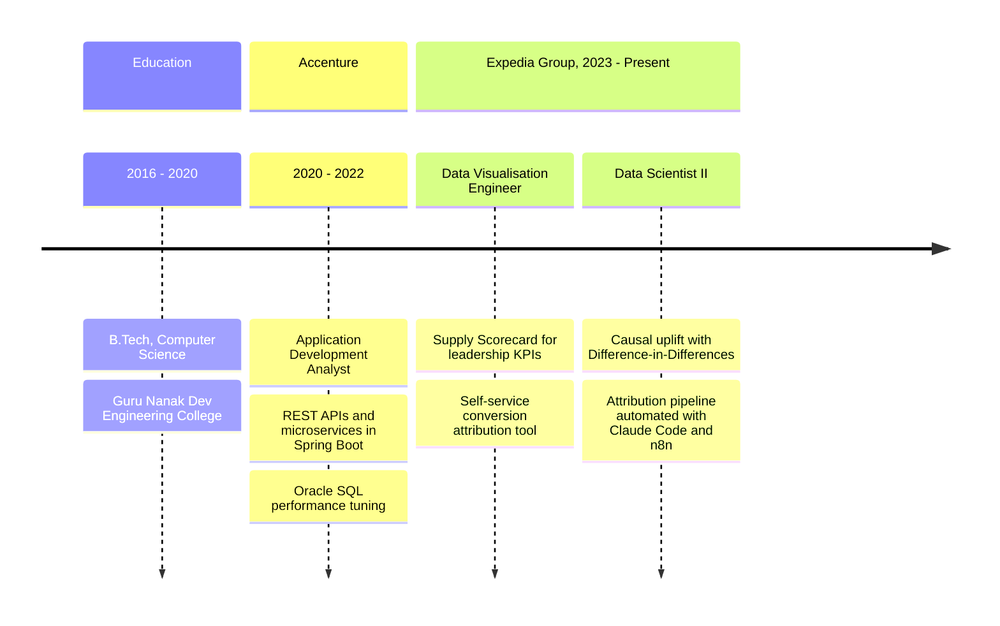

<!-- Header: animated wave banner -->
<p align="center">
  
</p>

<!-- Typing animation -->
<p align="center">
  <a href="https://git.io/typing-svg">
    
  </a>
</p>

<p align="center">
  <a href="https://www.linkedin.com/in/nagabhishek2/"></a>
  <a href="https://public.tableau.com/app/profile/datavizzaard/vizzes"></a>
  <a href="https://www.youtube.com/@datavizard"></a>
  <a href="mailto:comm.nag@gmail.com"></a>
</p>

---

### `> SELECT * FROM me;`

```sql
SELECT
    'Abhishek Nag'                                   AS name,
    'Data Scientist II, Vacation Rentals Supply Ops' AS role,
    'Expedia Group, Gurugram'                        AS based_at,
    'Causal inference, attribution, experimentation' AS works_on,
    'Claude Code + n8n pipelines that run themselves' AS tinkering_with,
    'Backend dev who fell for data'                  AS origin_story
FROM humans
WHERE curiosity > comfort
  AND coffee IS NOT NULL;
```

---

### 🎯 What I bring to the table

<table>
  <tr>
    <td align="center" width="25%"><h2>🧪</h2><b>Causal inference</b><br><sub>Difference-in-Differences to separate real uplift from noise</sub></td>
    <td align="center" width="25%"><h2>🔗</h2><b>Attribution</b><br><sub>SQL logic that ties revenue back to the actions that drove it</sub></td>
    <td align="center" width="25%"><h2>📊</h2><b>Self-serve analytics</b><br><sub>Scorecards and tools teams use without filing a ticket</sub></td>
    <td align="center" width="25%"><h2>🤖</h2><b>AI automation</b><br><sub>Claude Code and n8n workflows that take the grunt work out of analysis</sub></td>
  </tr>
</table>

---

### 🧭 The journey so far



<details>
<summary><b>🔍 What I actually do all day (click to expand)</b></summary>
<br>

- **Measure what worked.** Diff-in-Diff with co-treatment adjustments to estimate incremental revenue at marketplace scale.
- **Fix the numbers people argue about.** Used statistical analysis to right-size attribution windows so results mature faster without rewriting history.
- **Simulate before shipping.** Built a Python and PySpark simulator that stress-tests ranking logic across multiple scenarios before it reaches production.
- **Make debugging faster.** Wrote a Claude-based debugging skill for attribution investigations.
- **Tell the story.** Weekly, monthly and quarterly KPI reporting to stakeholder forums.

</details>

---

### 🛠️ Toolbox

**Data & ML**
<p>
  
  
  
  
  
  
  
  
  
  
  
</p>

**Viz & Storytelling**
<p>
  
  
  
</p>

**AI & Automation**
<p>
  
  
  
</p>

**Engineering roots**
<p>
  
  
  
  
  
  
</p>

---

### 📂 Around this profile

| Repo | What's inside |
|---|---|
| [danny_ma_sql_challenge](https://github.com/commnag/danny_ma_sql_challenge) | Solutions to Danny Ma's 8 Week SQL Challenge |
| [food_delivery_powerbi_dashboard](https://github.com/commnag/food_delivery_powerbi_dashboard) | Power BI dashboard answering 5 business questions for a food delivery company |
| [super_store_excel_dashboard](https://github.com/commnag/super_store_excel_dashboard) | Excel dashboard and written report on Super Store data |
| [pandas_bootcamp](https://github.com/commnag/pandas_bootcamp) | Pandas practice notebooks |

More viz work lives on [Tableau Public](https://public.tableau.com/app/profile/datavizzaard/vizzes) and [YouTube](https://www.youtube.com/@datavizard).

---

### 📊 GitHub pulse

<p align="center">
  
</p>

<!-- Footer wave -->
<p align="center">
  
</p>
